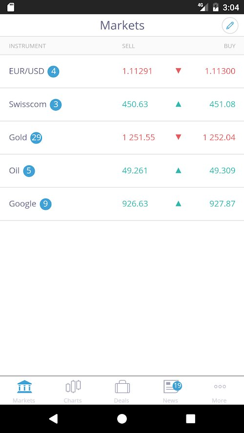
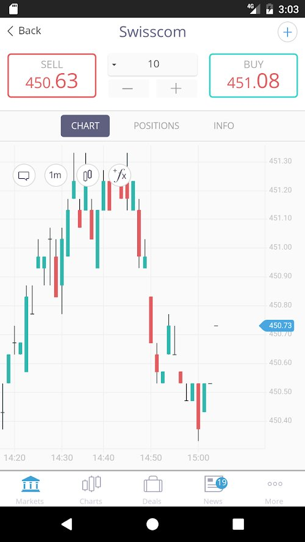
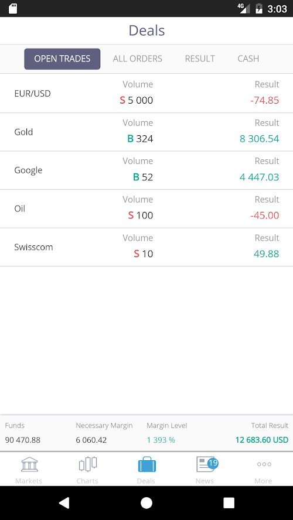
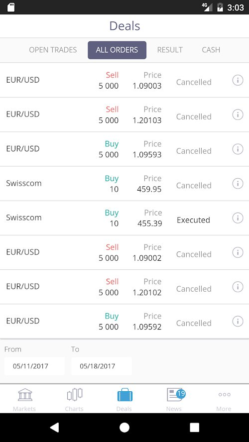
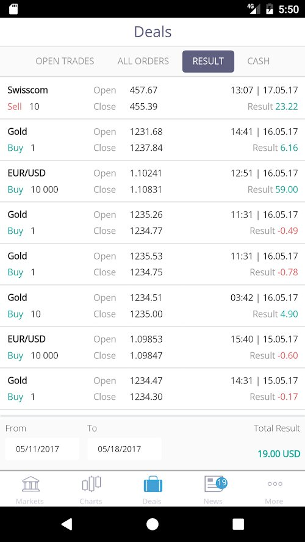

## Summary
The client came to the company where I was working at the time, and had a unique request. They had already successfully built a CFD trading website/platform and were looking for a few things we could provide.

1. Provide support for the already established code-base.
2. A complete design overhaul of the mobile version of the platform.
3. A iOS and android web app, matching the new mobile design.
4. Theming of the web-based desktop platform.
5. Copytrading profiles and functionality.

## Supporting the already established code-base.

As with any software product, shipping is just half the battle. Once you get that large flow of users, you need a dedicated team to iron out issues, impossible to catch on a smaller testing scale. Our team was tasked with handling defect resolution, and in the meantime aligning the code-base with established best practices.

Taking over a software project from another team is always a challenge as you need to step into the thoughts of the developers, when they were writing the code-base. This is also especially true when we're talking about a large-scale project, such as a trading platform. Luckily after a couple of introductory weeks we were confident enough to start making refactoring changes, without too much worry about regressions, as well as start providing adequate support for the platform. Afterwards things were pretty much "smooth sailing".

<!--  -->
<!--  -->

  
  
  
  
  

